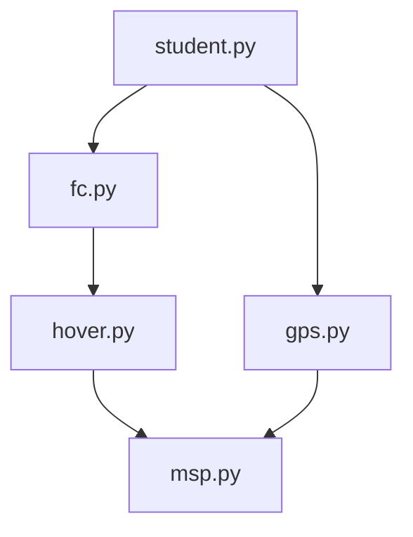

# AirXRP

<br/>
<p align="center">
    <a href="https://github.com/dutrevis/spark-resources-metrics-plugin" target="_blank">
        
    </a>
</p>

AirXRP is an educational quadcopter platform built around the SparkFun XRP Controller and Betaflight. The goal is to give students a simple Python interface for programming autonomous drone behaviors without requiring them to develop a flight-control system from scratch.

## Table of Contents
- [Prelude - Hardware](#prelude---hardware)
- [Chapter 1 - Preparation](#chapter-1---preparation)
  - [1.1 - Transmitter setup](#transmitter-setup)
  - [1.2 - Betaflight setup](#betaflight-setup)
  - [1.3 - XRP Files](#xrp-files)
  - [1.4 - OpenMV Camera setup](#openmv-camera-setup)
  - [1.5 - MSP Override Test](#msp-override-test)
  - [1.6 - Camera Axis Calibration](#camera-axis-calibration)
- [Chapter 2 - Functions to Use](#chapter-2---functions-to-use)
  - [2.1 - Drone API](#drone-api)
  - [2.2 - GPS](#gps)
- [Import Dependencies Diagram](#import-dependencies-diagram)
- [Debug](#debug)

## Prelude - Hardware
Before starting on this software guide, make sure to follow: https://www.printables.com/model/1707431-airxrp-alpha-xrp-powered-3d-printed-quadcopter for the hardware assembly of the AirXRP.

## Chapter 1 - Preparation

### Transmitter setup
Turn on the transmitter

1. long hold "OK" button until you see MENU screen
2. click "OK" to go into SYSTEM screen
3. click "DOWN" until reaching "Aux switches", click "OK"
4. Turn all switches On by clicking "UP" and "OK" to move to the next switch, when reaches "Ch", click "UP" until Ch:10. **Long hold "Cancel" button to save everything**
5. Click "Cancel" to go back to MENU, and click "UP" and "OK" to go into FUNCTIONS screen
6. Click "DOWN" until reaching "Aux, channels", click "OK"
7. Click "OK" until reaching Channel 7, while arrows are point at Channel 7 and Source, click "DOWN" until Source is SwA, click "OK". Repeat for Channel 8, 9 and 10, each corresponding to SwB, SwC, SwD, respectively. **Long hold "Cancel" button to save everything**

This sets the switches from left to right, to AUX3, 4, 5, and 6, the left spin knob to AUX1, and right spin knob to AUX2, in betaflight.

### Betaflight setup
Open Betaflight app https://app.betaflight.com/ and connect to the flight controller through the on board usb-c port

1. In Sensors tab, change Pitch degrees from 0 to 180 under Board Alignment. Click Calibrate. 
2. In Ports tab, enable Configuration/MSP for UART4 and Serial RX for UART7, click Save and Reboot in the lower right hand side corner.
3. In Receiver tab, for serial receiver provider, change CRSF to IBUS, click Save in the lower right hand side corner.

Checkpoint: Turning on the transmitter and the drone, you should see roll, pitch, yaw, throttle, and the auxiliary channels change when moving the sticks and switches on your transmitter.

4. In CLI tab, type in "set msp_override_channels_mask = [number]" where [number] is what controls you would like the xrp to control when in msp override mode. Default full control of roll, pitch, throttle, and yaw is 15. For more information on what number to use, check out [Developer Guide](#developer-guide).
5. In modes tab, enable ARM with an AUX and Min Max of your choice, enable ANGLE if you would like to fly in ANGLE mode, and after setting a number for msp_override_channels_mask, enable MSP OVERRIDE with an AUX and MIN MAX of your choice. 
6. In PID Tuning, change Motor Output Limit from 100 to 66.
7. In Motors Tab, click on Reorder motors and then motor direction and follow the instructions to setup motors. Make sure to plug in the battery for the motors to run.

Checkpoint: The drone should now be capable of manual flying.

### XRP Files

Make sure your XRP contains
- airxrp_openmv_axis_calibrate.py
- fc.py
- gps.py
- hover.py
- msp.py
- msp_test.py

### OpenMV Camera setup

Download OpenMV IDE: https://openmv.io/pages/download?srsltid=AfmBOoorWgGWSutgBUVmrJHAUmXsZcqh9ppmNFL8Xp0shk191VoGpuC1

Save mavlink_opticalflow_openmw_ide.py to main by
1. connect OpenMV camera to the OpenMV camera ide through on board usb-c port
2. go to file explorer and look for OpenMV camera disk
3. open OpenMV camera disk and open the file "main"
4. copy mavlink_opticalflow_openmw_ide.py into the file "main" and save the file

### MSP Override Test
XRP controls the drone through Betaflight MSP Override. This communication happens through msp.py. We want to make sure the drone is setup properly to communicate between the XRP the flight controller.

**Run msp_test.py** 

If you receive: 
"SUCCESS: MSP communication working both ways" 
This means your hardware setup is correct and ready to go

If you receive:
"No response"
Check out [Debug](#debug)

### Camera Axis Calibration
The OpenMV may be mounted in different orientations, so AirXRP does not assume camera X/Y correspond directly to aircraft roll/pitch.
Before hover() is used, **run airxrp_openmv_axis_calibrate.py**

The calibration procedure is:
Hold the drone level and still.
Move the entire aircraft approximately 10–20 cm to its physical right.
Return it and hold still.
Move the aircraft approximately 10–20 cm forward.
Keep the aircraft level and avoid yawing it.
The script determines the transformation from camera coordinates into aircraft body coordinates and writes:
/openmv_axis_calibration.txt 

> :exclamation: **Make sure /openmv_axis_calibration.txt is saved in the XRP before running hover()**

The calibration only needs to be repeated if the camera mounting orientation changes.

## Chapter 2 - Functions to Use

Create a new file (ex: student.py) as the main file to work with.

### Drone API
The Drone class provides the student-facing interface. It can be found in fc.py.
Current movement functions include:
- move_forward()
- move_backward()
- move_left()
- move_right()
- hover() (with manual control of throttle)

Example:
```python
from fc import Drone

drone = Drone()

# Pilot manually raises the drone to the desired altitude.

# Hold the drone's horizontal X/Y position for 5 seconds.
# Pilot continues controlling throttle.
drone.hover(duration=5)

# Move forward for 1 second.
drone.move_forward(speed=0.3, duration=1)

# Hold horizontal position again.
drone.hover(duration=5)
```

### GPS
AirXRP also supports a GPS module using gps.py

GPS is intended primarily for larger-scale position and waypoint behaviors, while OpenMV optical flow provides faster local motion correction near the ground.

Current GPS functions include:
- get_location() — returns latitude, longitude, and altitude
- set_origin() — saves the current GPS location as x = 0, y = 0, z = 0
- get_xyz() — returns position in meters relative to the saved origin

Example:
```python
from gps import AirXRPGPS

gps = AirXRPGPS()

gps.set_origin()

while True:
    position = gps.get_xyz()

    if position:
        print("X:", position["x"], "m")
        print("Y:", position["y"], "m")
        print("Z:", position["z"], "m")
    else:
        print("No GPS position")
```

## Import Dependencies Diagram



## Debug

### no response from msp override

- Make sure flight controller is powered on
- Make sure UART4 in Betaflight is enabled for Configuration/MSP
- Unplug and replug in wire from xrp to flight controller, make sure all wires are connected. Often times it is a physical connection problem

### openmv camera not found at 0x42

- plug usb-c cable into openmv camera port for a few seconds and plug ucb-c cable back into xrp. This should reset the code in the openmv camera for it to run again.

